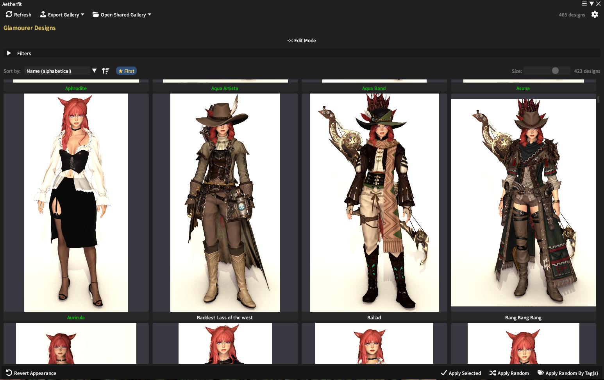
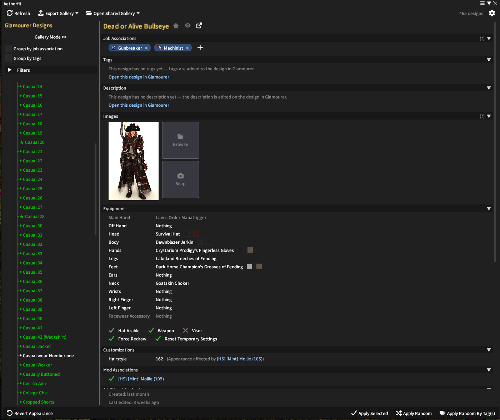
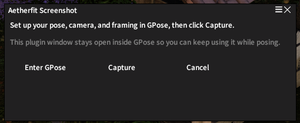
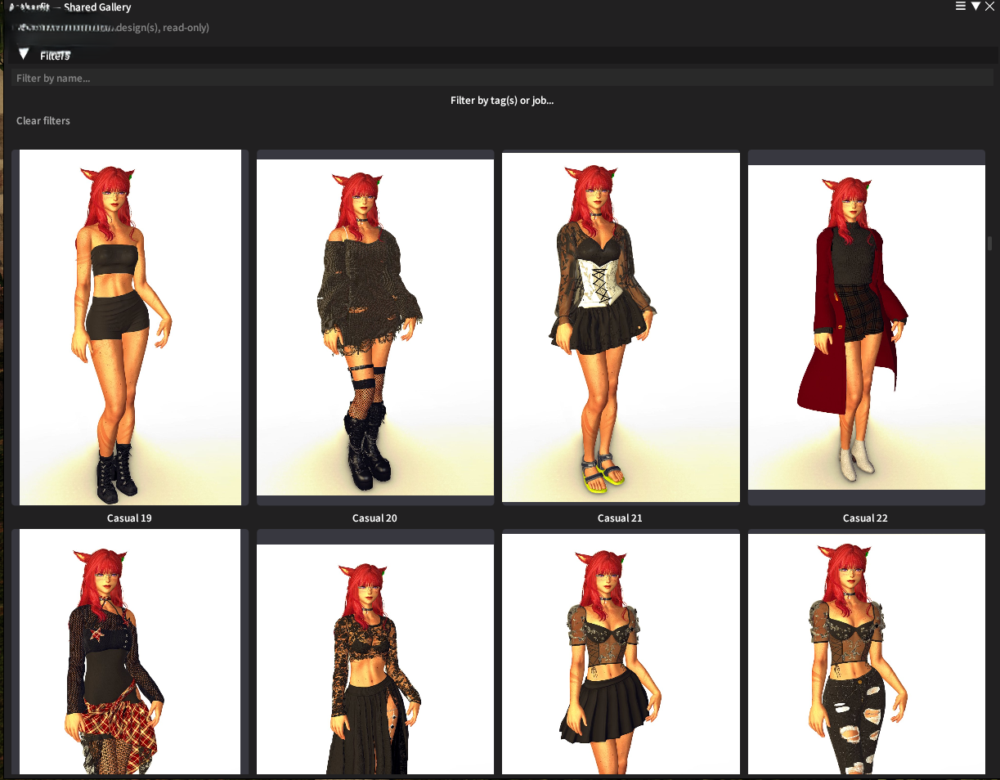
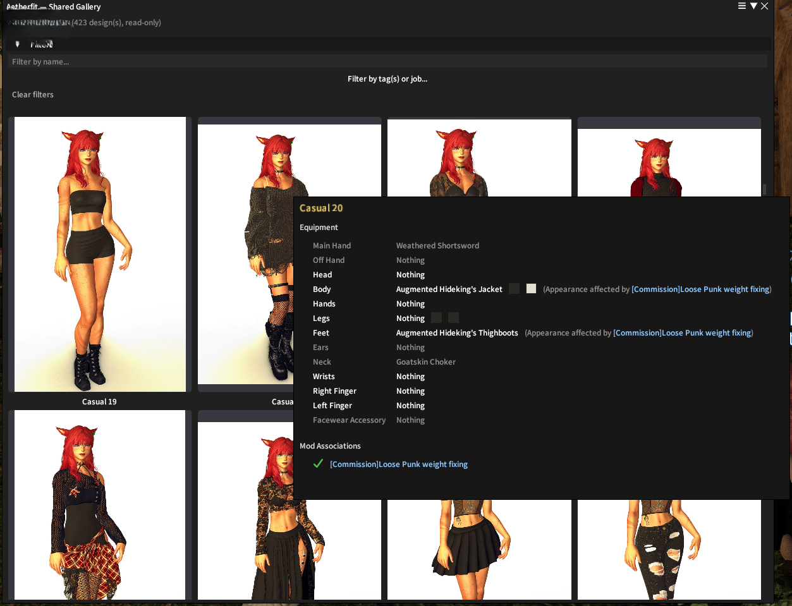
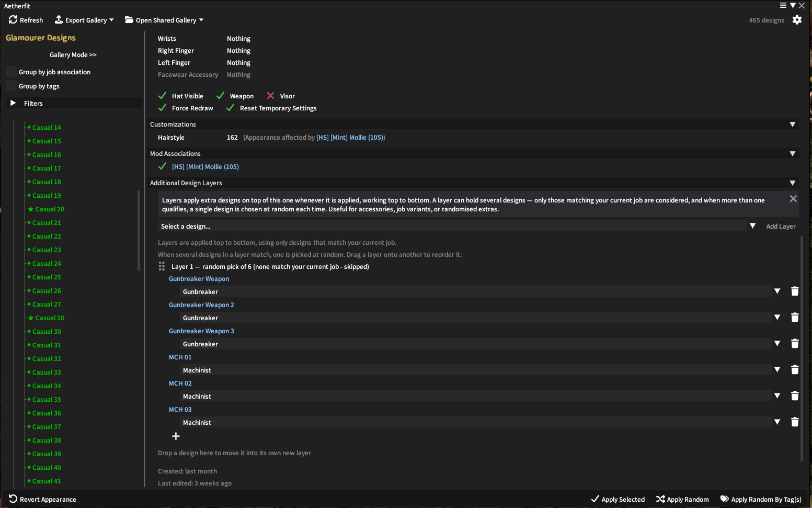

# Aetherfit


**Requires:** [Penumbra](https://github.com/xivdev/Penumbra), [Glamourer](https://github.com/Ottermandias/Glamourer)

Glamourer is a powerful tool for managing and applying designs to your characters in Final Fantasy XIV. Aetherfit builds on top of it with a more intuitive, gallery-style frontend for browsing and applying those designs, while still relying on Glamourer for the actual design data and application process and keeping it as the source of truth for all your designs.

Aetherfit is meant to be a lightweight, easy-to-use alternative to the default Glamourer interface — making it much easier to quickly find and apply the perfect design for any occasion. You'll still use Glamourer itself to create, edit, and manage your actual designs; Aetherfit is focused purely on making it quick and easy to choose which one to switch to.

It also provides a quick and easy way to preview your designs with screenshots and images that can be added to them. Screenshots can either be loaded from disk or taken directly in game.

> **Tip:** this isn't required, but if your designs rely on mods through Penumbra, the ideal setup is to use mod associations with temporary settings on your Glamourer designs, rather than enabling everything all the time. That way the relevant mods are automatically turned on and off as you switch between designs. See [this guide](https://docs.google.com/document/d/1WxaNWRRTlm5o6KShM_so54yoD5RDPIpFg2UqSid71ek/edit?tab=t.nb010xi108ph#heading=h.o8utyg3da3rc) for a brief explanation of mod associations and temporary settings.

It adds the following functionality:
- Browse designs by tags
- Add screenshots to designs
- Apply a random design to your character or a random design based on a selection of tags
- The ability to apply a random design (Or random design based on tags) to a character when logging in.
- Share your design gallery wiith friends
- Associate designs with specific jobs
- Apply multiple layered designs (Including ability to randomly select a design from a pool, useful for having a random weapon appearance as an example)

---

***Important Note***, this has only been tested on the FFXIV client on Windows.  Whilst the bulk of the plugin should work no matter what, the direct screenshot capture might not work on other clients/operating systems.

---
## For Users

### Installation

Open the Dalamud Settings menu in game and follow the steps below. This can be done through the button at the bottom of the plugin installer or by typing `/xlsettings` in the chat.

1. Go to the **"Experimental"** tab.
2. Under Custom Plugin Repositories, enter the repository URL into the empty box at the bottom:
   ```
   https://raw.githubusercontent.com/Kussie/Aetherfit/master/repo.json
   ```
3. Click the **"+"** button.
4. Click the **"Save and Close"** button.

Once added, find Aetherfit in the main `/xlplugins` window and install it. You can then access the plugin by typing `/aetherfit` in chat.

### Command Usage
`/aetherfit` - Opens the main interface.

`/aetherfit random` - Apply a random design from your entire collection of designs.

`/aetherfit tag <tag1,tag2,...>` - Apply a random design that has all of the listed tags. Separate multiple tags with commas.

`/aetherfit tag favourite <tag1,tag2,...>` - Same, but only picks from your favourites.

`/aetherfit job` - Apply a random design associated with your current job. Job associations are set per-design in the design details pane.

`/aetherfit favourite [job]` - Apply a random favourite design. Add `job` to only pick favourites associated with your current job.

`/aetherfit last` - Reapply the last design you had worn.

`/aetherfit revert` - Revert your character to the game's state.

`/aetherfit help` - List these commands in chat.

---

## TODO/Wishlist
Small bugs, QOL and big dream items that have popped into my head.  When and if they are implemented remains to be seen.
 - Integrate with Simple Glamour Switcher
 - Investigate IAsyncDalamudPlugin
 - Add an IPC


---

## Screenshots:

Main Interface:





"Snap" options:



Cropping/Selecting area to use:


Shared Gallery:





Additional Layers (This setup is picking a random MCH and GNB weapon when the design is applied):




---

## AI Usage Disclosure

This project was created with the assistance of AI tools. AI was used to help prototype ideas and refine certain areas, but the final work was reviewed, edited, and completed by me. It was not entirely written or generated by AI.
