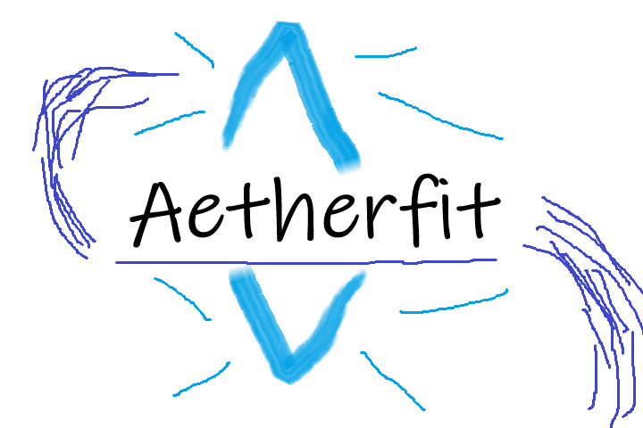

# Aetherfit

Aetherfit is an alternative frontend for Glamourer.  It provides a user-friendly interface for choosing from designs from Glamourer.  Glamourer is still the source of truth for your designs.

It adds the following functionality:
 - Browse designs by tags
 - Add screenshots to designs
 - Apply a random design to your character or a random design based on a selection of tags
 - The ability to apply a random design (Or random design based on tags) to a character when logging in.

**Requires:** [Penumbra](https://github.com/xivdev/Penumbra), [Glamourer](https://github.com/Ottermandias/Glamourer)

Glamourer is a powerful tool for managing and applying designs to your characters in Final Fantasy XIV. Aetherfit aims to provide a more intuitive and user-friendly interface for selecting and applying designs, while still relying on Glamourer for the actual design data and application process.

Aetherfit is designed to be a lightweight and easy-to-use alternative to the default Glamourer interface, allowing users to quickly and easily find and apply designs to their characters. With its intuitive design and powerful filtering capabilities, Aetherfit makes it easy to find the perfect design for any occasion.

Aetherfit also provides a quick and easy way to preview your designs with screenshots that can be added to your designs. Screenshots can either be loaded from disk or taken directly in game.

## Screenshots:

Main Interface:

"Snap" options:

Cropping/Selecting area to use:

