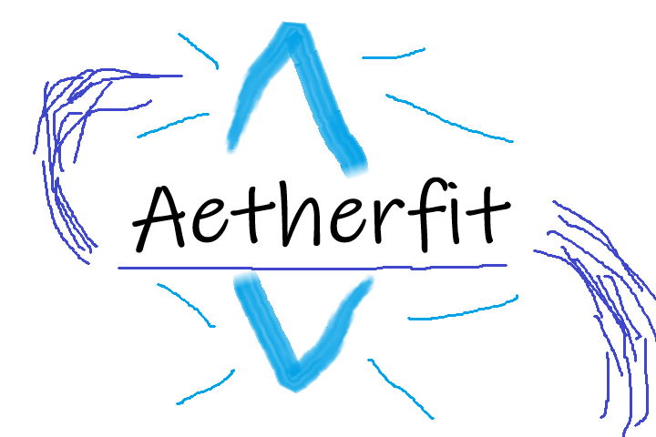
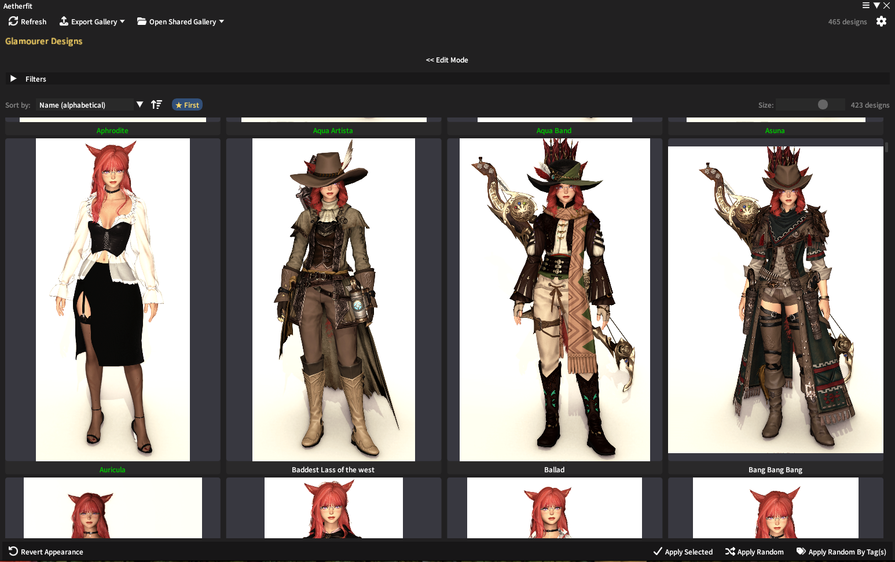
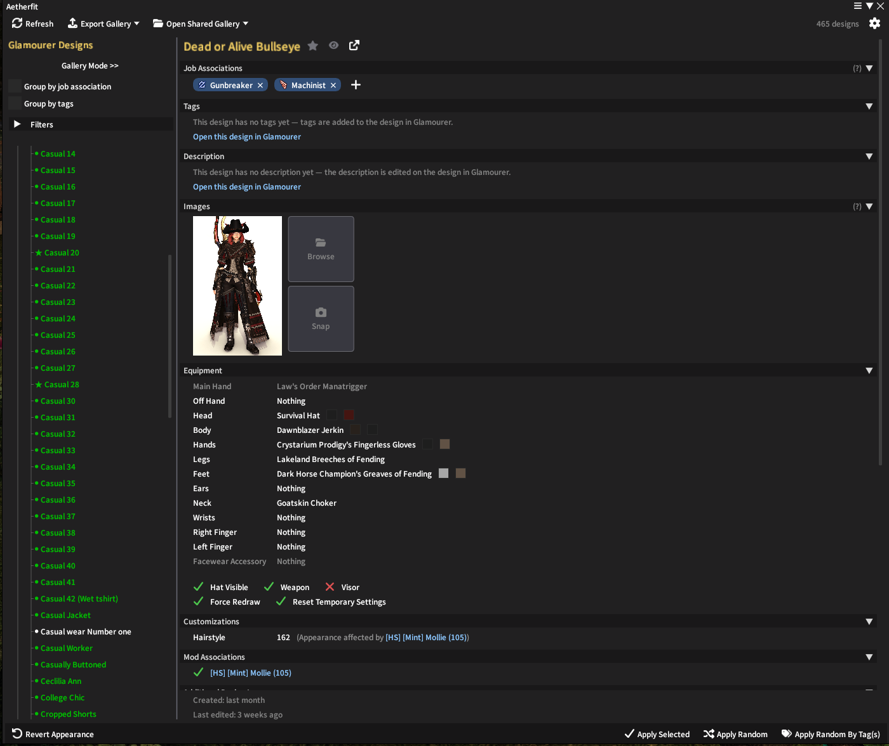
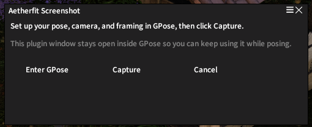
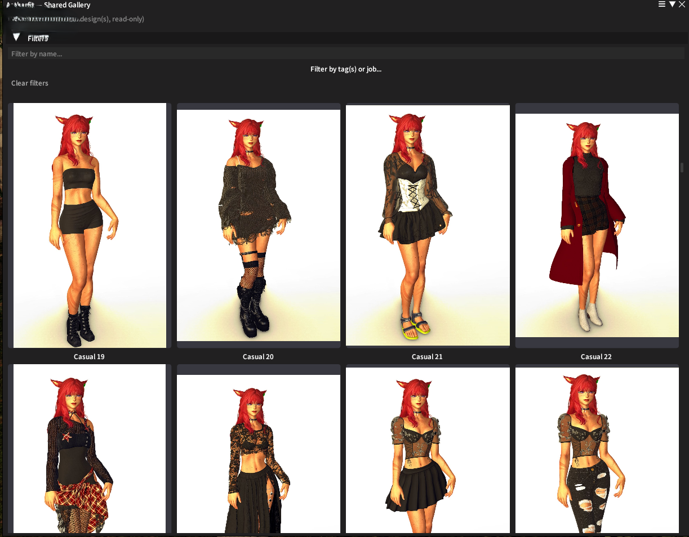
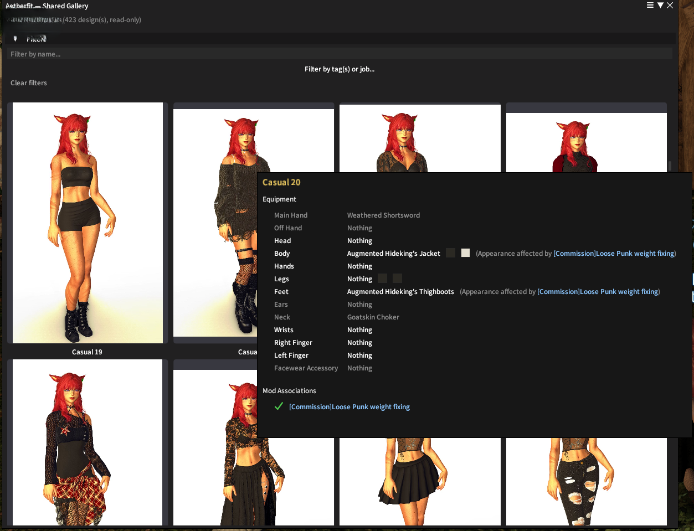
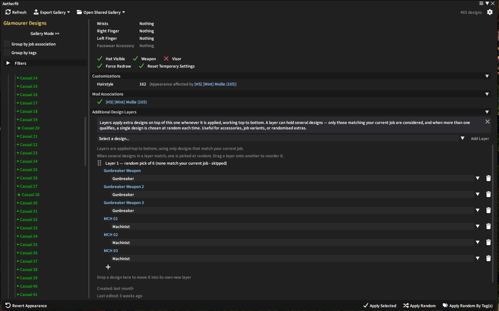

# Aetherfit


**Requires:** [Penumbra](https://github.com/xivdev/Penumbra), [Glamourer](https://github.com/Ottermandias/Glamourer)

**Optional:** [Glamaholic](https://github.com/caitlyn-gg/Glamaholic) — if installed, Aetherfit can also browse and apply your Glamaholic plates. The game's own native Glamour Plates are supported too, no extra plugin required. Both sources can be toggled on or off independently from the Integrations tab.

**Optional:** [Simple Glamour Switcher](https://github.com/Caraxi/SimpleGlamourSwitcher) — if installed, Aetherfit can also browse and apply your SGS designs.

Glamourer is a powerful tool for managing and applying designs to your characters in Final Fantasy XIV. Aetherfit builds on top of it with a more intuitive, gallery-style frontend for browsing and applying designs. Designs no longer have to live in Glamourer itself, either — Aetherfit can pull them in from **Glamaholic**, **Simple Glamour Switcher** and the game's own **Glamour Plates** too, showing everything together in one unified gallery regardless of where it's actually saved. Glamourer remains required either way, since it's still the engine Aetherfit uses to actually apply an outfit to your character, no matter which source a design came from.

Aetherfit is meant to be a lightweight, easy-to-use alternative to the default Glamourer interface — making it much easier to quickly find and apply the perfect design for any occasion. You'll still use Glamourer itself (or Glamaholic, or the game's own Glamour Dresser) to create, edit, and manage your actual designs; Aetherfit is focused purely on making it quick and easy to choose which design to switch to quickly.

It also provides a quick and easy way to preview your designs with screenshots and images that can be added to them. Screenshots can either be loaded from disk or taken directly in game.

> **Tip:** this isn't required, but if your designs rely on mods through Penumbra, the ideal setup is to use mod associations with temporary settings on your Glamourer designs, rather than enabling everything all the time. That way the relevant mods are automatically turned on and off as you switch between designs. See [this guide](https://docs.google.com/document/d/1WxaNWRRTlm5o6KShM_so54yoD5RDPIpFg2UqSid71ek/edit?tab=t.nb010xi108ph#heading=h.o8utyg3da3rc) for a brief explanation of mod associations and temporary settings.

It adds the following functionality:
- Source designs from Glamourer, Glamaholic, Simple Glamour Switcher, and the game's own Glamour Plates, all in one gallery
- Browse designs by tags
- Add screenshots to designs
- Get AI-suggested tags for a design based on its own screenshots, powered by a local, on-device image tagger — nothing is ever uploaded anywhere
- Apply a random design to your character or a random design based on a selection of tags
- The ability to apply a random design (Or random design based on tags) to a character when logging in
- Share your design gallery with friends
- Associate designs with specific jobs
- Apply multiple layered designs (Including ability to randomly select a design from a pool, useful for having a random weapon appearance as an example), with the ability to apply additional designs before or after the main design.  Useful for having different designs for accessories and such (including the ability to apply layers on bulk)
- Health Report, show designs that having missing mods, duplicate designs, broken items, and or items that can't be worn by your current race/gender
- Export a printable PDF "look book" of your design covers, for showing off outside the plugin
- Mark a design as a variant of another (e.g. same mod with different settings, or the same style in a different colour) — it appears nested under its parent in the tree and stacked behind it in the gallery, and can optionally inherit the parent's layers, tags/description, and gear
- Batch Screenshot mode — pick a set of designs (by tag, job, or source) and Aetherfit applies each one in turn, waits an adjustable delay, captures it with a fixed centered crop, and saves it as that design's cover — unattended, with a framing guide overlay to line up your camera first
- Quick Search: a global keybind (set in Settings → Keybinds) pops open a small command-palette-style search box — type a design's name and hit Enter to apply it instantly without opening the main window
- Filter by equipment slot — find designs with actual gear equipped in one or more specific slots (Head, Body, Legs, etc.), requiring all selected slots to be filled rather than any
- A "What's New" window pops up automatically after an update that adds something worth announcing (not on routine releases), and won't show again once dismissed

> **Composite tags:** tags can be written as `category/type`, e.g. `swimsuit/bikini` or `colour/blue`. A design tagged this way matches filters for the full tag *or* either half on its own — so it shows up whether you filter by `swimsuit/bikini`, just `swimsuit`, or just `bikini`, without having to add all three as separate tags. When designs are grouped by tags instead of folders, composite tags also build a nested tree instead of one flat entry — `swimsuit/bikini` shows up as a `swimsuit` branch containing a `bikini` branch, and a design carrying `summer/casual` and `winter/casual` appears under both, keeping same-named subtags (like `casual`) apart under their own parent.

> **AI tag suggestions:** click the "Suggest tags" button in a design's Tags section to have a local image-tagging model look at that design's screenshots and propose tags for it — pick the ones you want and add them with one click. Everything runs on your own PC; no image or tag data is ever sent anywhere. The first time you use it, Aetherfit downloads a one-time model (choose from five, ranging from a few hundred MB up to ~1.2 GB, trading off size/speed against accuracy) plus the ONNX Runtime needed to run it — both configurable from **Settings → Tag Suggestions**, along with the suggestion confidence threshold, an option to also suggest composite tags (see above), and a blacklist for tags you never want suggested again (Shift+right-click a suggestion, or add one manually in Settings).

---

***Important Note***, this has only been tested on the FFXIV client on Windows.  Whilst the bulk of the plugin should work no matter what, the direct screenshot capture might not work on other clients/operating systems.

---
## For Users

### Installation

Open the Dalamud Settings menu in game and follow the steps below. This can be done through the button at the bottom of the plugin installer or by typing `/xlsettings` in the chat.

1. Go to the **"Experimental"** tab.
2. Under Custom Plugin Repositories, enter the repository URL into the empty box at the bottom:
   ```
   https://raw.githubusercontent.com/Kussie/Aetherfit/master/repo.json
   ```
3. Click the **"+"** button.
4. Click the **"Save and Close"** button.

Once added, find Aetherfit in the main `/xlplugins` window and install it. You can then access the plugin by typing `/aetherfit` in chat.

### Command Usage
`/aetherfit` - Opens the main interface.

`/aetherfit random` - Apply a random design from your entire collection of designs.

`/aetherfit tag <tag1,tag2,...>` - Apply a random design that has all of the listed tags. Separate multiple tags with commas.

`/aetherfit tag favourite <tag1,tag2,...>` - Same, but only picks from your favourites.

`/aetherfit job` - Apply a random design associated with your current job. Job associations are set per-design in the design details pane.

`/aetherfit favourite [job]` - Apply a random favourite design. Add `job` to only pick favourites associated with your current job.

`/aetherfit wear "design name"` - Apply the design with this exact name. The name must be in quotes, even if it's a single word.

`/aetherfit last` - Reapply the last design you had worn.

`/aetherfit revert` - Revert your character to the game's state.

`/aetherfit help` - List these commands in chat.

---

## TODO/Wishlist
Small bugs, QOL and big dream items that have popped into my head.  When and if they are implemented remains to be seen.
 - Investigate IAsyncDalamudPlugin
 - Add an IPC


---

## Screenshots:

Main Interface:





"Snap" options:



Cropping/Selecting area to use:


Shared Gallery:





Additional Layers (This setup is picking a random MCH and GNB weapon when the design is applied):




---

## AI Usage Disclosure

This project was created with the assistance of AI tools. AI was used to help prototype ideas and refine certain areas, but the final work was reviewed, edited, and completed by me. It was not entirely written or generated by AI.
